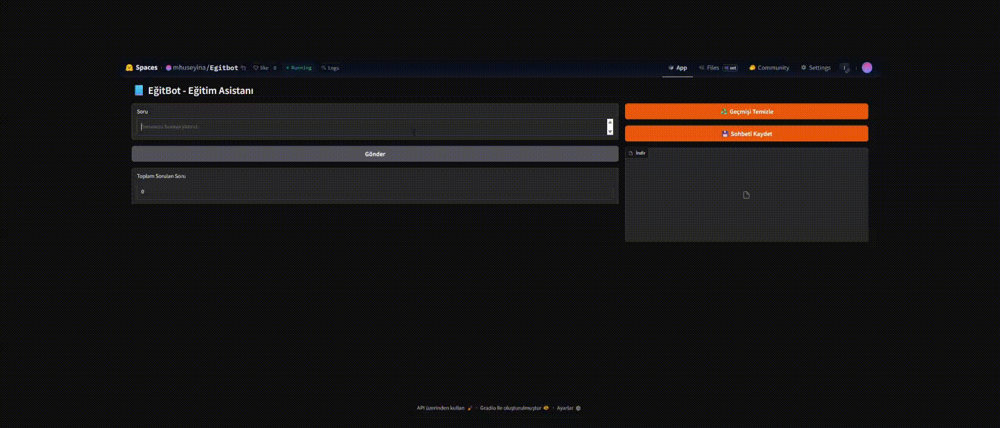

# 📘 EğitBot - RAG Tabanlı Eğitim Asistanı

EğitBot, Türkçe eğitim içerikleriyle eğitilmiş bir RAG (Retrieval-Augmented Generation) tabanlı akıllı eğitim asistanıdır. Öğrencilerin ders sorularını anlamlı, sade ve açıklayıcı şekilde yanıtlayarak öğrenme süreçlerine yardımcı olur.

Bu proje, LangChain, Google Gemini Pro, FAISS, Gradio ve çeşitli Türkçe eğitim veri setleri ile güçlendirilmiştir.

## DEPLOY LİNK
https://huggingface.co/spaces/mhuseyina/Egitbot


Soru kutusundan sorularımızı soruyoruz.Aldığımız cevaplar sohbet geçmişinde görüntüleniyor.
Sorulan sayı istatistiği tutuluyor ve gösteriliyor.
Sohbet geçmişi istenirse indirilebilir hale getiriliyor .txt dosyası olarak alınabiliyor.
Sohbet geçmişi temizlenebiliyor.
## 📚 Kullanılan Veri Setleri

Proje kapsamında aşağıdaki Türkçe veri setleri kullanılmıştır. Bu veri setleri, eğitim içeriklerinin zenginleştirilmesi ve sorulara doğru yanıtlar verebilmek için kullanılmıştır.

| Veri Seti                         | Açıklama                             | Hugging Face Linki                                                                                  |
|----------------------------------|------------------------------------|---------------------------------------------------------------------------------------------------|
| Orca Math Word Problems TR        | Türkçe matematik kelime problemleri| [duxx/orca-math-word-problems-tr](https://huggingface.co/datasets/duxx/orca-math-word-problems-tr) |
| Karayel-DDI Türkçe MATH-Hard     | Zorlayıcı Türkçe matematik soruları| [Karayel-DDI/Turkce_Lighteval_MATH-Hard](https://huggingface.co/datasets/Karayel-DDI/Turkce_Lighteval_MATH-Hard) |
| Korkmazemin1 Turkish Education Dataset | Genel Türkçe eğitim soruları ve cevapları | [korkmazemin1/turkish-education-dataset](https://huggingface.co/datasets/korkmazemin1/turkish-education-dataset?utm_source=chatgpt.com) |
| Musabg Wikipedia Turkish Summarization | Türkçe Wikipedia metin özetleri   | [musabg/wikipedia-tr-summarization](https://huggingface.co/datasets/musabg/wikipedia-tr-summarization) |

## 🧱 EğitBot RAG Pipeline Mimarisi

**EğitBot**, eğitim odaklı Türkçe bir RAG (Retrieval-Augmented Generation) tabanlı sohbet asistanıdır. Aşağıdaki adımlarla çalışır:

1. **Veri Yükleme (Content Extraction):**  
   Hugging Face `datasets` kütüphanesi ile çeşitli Türkçe eğitim veri setleri (matematik soruları, eğitim içerikleri, Wikipedia özetleri) indirilip yüklenir.

2. **Akıllı Parçalama (Intelligent Chunking):**  
   `TokenTextSplitter` kullanılarak uzun metinler, anlamlı ve optimize edilmiş parçalara (chunk) bölünür.

3. **Vektör Dönüşümü (Vector Embedding):**  
   `sentence-transformers/all-MiniLM-L6-v2` modeli ile metin parçaları sayısal vektörlere dönüştürülür.

4. **Vektör Depolama (Vector Storage):**  
   FAISS kütüphanesi ile embedding vektörleri yerel bir veritabanında saklanır ve hızlı erişim sağlanır.

5. **Bağlam Eşleştirme (Context Matching):**  
   Kullanıcı sorusu ile ilgili en alakalı 3 doküman FAISS üzerinden çekilir.

6. **Yanıt Üretimi (Response Generation):**  
   Google Gemini tabanlı `ChatGoogleGenerativeAI` modeli, getirilen bağlam ve kullanıcı sorusuna dayanarak öğretici ve sade cevaplar üretir.


## 🚀 Özellikler

🔍 RAG tabanlı bilgi getirme (retrieval) desteği

🇹🇷 Türkçe eğitim verileriyle zenginleştirilmiş bilgi tabanı

🤖 Google Gemini 2.5 Pro (LLM) ile doğal dilde yanıt üretimi

🧠 FAISS vektör veritabanı ile hızlı sorgu yanıtı

📝 Soru geçmişi ve sohbet kaydetme özellikleri

💾 Sohbeti .txt dosyası olarak indirme

🎨 Kullanıcı dostu Gradio arayüzü

## 🧱 Kullanılan Kütüphaneler

Proje kapsamında aşağıdaki Python paketleri kullanılmaktadır:

- gradio
- python-dotenv
- langchain
- langchain-community
- langchain-google-genai
- langchain-huggingface
- sentence-transformers
- faiss-cpu
- datasets==2.18.0
- requests
- torch
- transformers
- huggingface-hub
- tiktoken

# 📦 Kurulum
1. Ortamı Hazırlama
```bash
# Depoyu klonla
git clone https://github.com/hseyinatalan/Egitbot-Chatbot.git
cd Egitbot-Chatbot

# Sanal ortam oluştur
python -m venv venv

# Sanal ortamı aktifleştir

# macOS / Linux:
source venv/bin/activate

# Windows:
venv\Scripts\activate
```

2. Gerekli Paketleri Yükleme
```bash
pip install -r requirements.txt
 ```
3. API Anahtarlarını Ayarlama
Aşağıdaki ortam değişkenlerini .env dosyası olarak veya terminalden tanımlayın:
```bash
export GOOGLE_API_KEY="YOUR_GOOGLE_API_KEY"
export HUGGINGFACEHUB_API_TOKEN="YOUR_HUGGINGFACE_TOKEN"
```
4. Uygulamayı Başlat
```bash
python app.py
```
## 📁 Proje Yapısı
```
├── app.py # Ana uygulama dosyası
├── requirements.txt # Python bağımlılıkları
├── .env # API anahtarları (git'e eklenmez)
├── README.md # Bu dosya
```
## 💡 Neler Farklı Yapılabilr
- Verisetlerindeki tüm veriler ile çalışılmadı çünkü huggingface de sunmak için limit koymam gerekti.Daha verimli olması için yerelde çalıştırılıp tüm veri ile çalıştırılabilir.
- Projeyinin başında yerelde çalışan bir model indirip onun ile oluşturdum tabiki sistemi zorlayan bir durum oluştu 4 ayrı verisetini işleyince ama sonucunda gayet tatmin eden bir durum oluştu.
- Projeyi deploy etmem gerektiği için bu modelden vazgeçip gemini 2.5-pro ile devam ettim. Google 30 günlük deneme verdiği için flash yerine pro yu tercih ettim.
- Projenin şuanki halinden gayet memnunum birçok kez denemeler yaptım ve yanıltıcı vs. cevaplar almadım.Tabiki bazı sorulara özellikle lise düzeyi zor sorularda arada bir "bu cevap bende yok" gibi dönüşler verdi.Bunun sebebi büyük ölçüde verisetlerini kısıtlama zorunluluğum oldu.
- Projeyi daha iyi hale getirmek için yapılabilecek şeyler verisetlerini büyütmek ve arayüzde daha çok kullanıcıya yardımcı eklentiler eklenebilir.

## 🙏 Teşekkür
Bu projeyi yapmama vesile olan Global AI Hub tarafından yapılan Akbank Generative AI Giriş Bootcamp'idir.Topluluk Liderleri ve Mentorlarımıza verdikleri eğitimler için teşekkür ederim.
